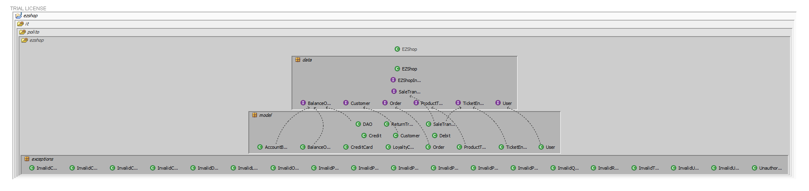
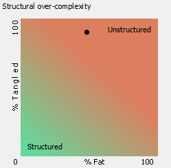
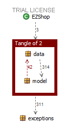

# Design assessment


```

```

# Levelized structure map
```

```



# Structural over complexity chart
```

```



# Size metrics

```
```


| Metric                                    | Measure |
| ----------------------------------------- | ------- |
| Packages                                  |      6   |
| Classes (outer)                           |    43     |
| Classes (all)                             |  46       |
| NI (number of bytecode instructions)      |  7,160       |
| LOC (non comment non blank lines of code) |   3,079      |


# Items with XS

```

```

| Item 					| Tangled | Fat  | Size | XS   |
| ----------------------------------------- | ------- |---|---|---|
| ezshop.it.polito.ezshop.data.EZShop | 	 | 157 	  | 3,636 | 856 |
| ezshop.it.polito.ezshop |  6%      |   5   |  7,160    | 448     |
| ezshop.it.polito.ezshop.data.EZShop.returnProduct(java.lang.Integer, java.lang.String,int):boolean |		  | 24 |   135 |   50 |
| ezshop.it.polito.ezshop.data.EZShop.updateProduct(java.lang.Integer, java.lang.String, java.lang.String,double,java.lang.String):boolean |		| 16 |     103 |   6 |
| ezshop.it.polito.ezshop.data.EZShop.modifyCustomer(java.lang.Integert,java.lang.String,java.lang.String):boolean  | | 16 | 108 | 6 |


# Package level tangles

```


```



# Summary analysis
```
Not many differences ahs been introduced in our design since the 30th April.
DAO was added, cause no module has been though to communicate with a database.
Product was deleted, since it was not necessary anymore.
Some classes have been improved through private classes or enum to implement some functionalities which have always been thought of only at a high level.

The current structure is strong enough to guarantee mantainability even if other funcitonalies would have been added, the Facade pattern is the main contributor to this point.
Altough all these aspects, maybe a more structured packaging would have helped in code organization and in access type to classes' variables.

```
