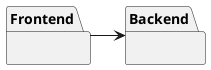
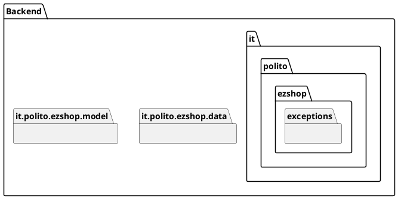
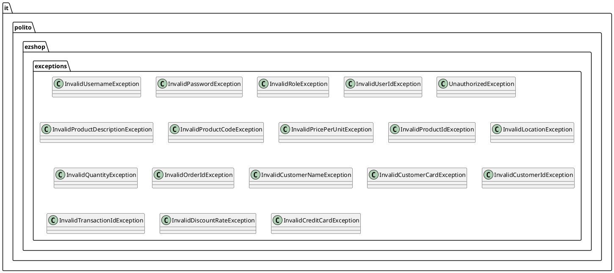
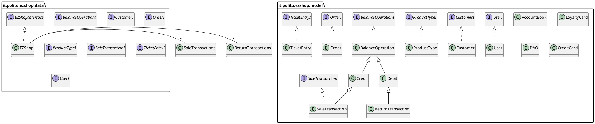

# Design Document 

Authors: Andrea Colli Vignarelli, Roberto Comella, Stefano Palmieri, Filippo Peron

Date: April 30th 2021

Version: 0.1


# Contents

- [High level design](#package-diagram)
- [Low level design](#class-diagram)
- [Verification traceability matrix](#verification-traceability-matrix)
- [Verification sequence diagrams](#verification-sequence-diagrams)

# Instructions

The design must satisfy the Official Requirements document, notably functional and non functional requirements

# High level design 

The style of our app is client only, with access to a global database. Clients are PCs.
Our frontend is the GUI, our backend is the app + database.



## Front End

The front end is produced externally, it is not considered in this document.

## Back End

The back end is implemented using Java. Expose an API interface in the shop package through "EZShopInterface".

### Packge overview


### Packages details

Here we show the classes included in each package, the relationships between different packages classes and some of the main relationships between same package classes (more details about this part [here](#class-diagram)).






# Low level design
## it.polito.ezshop.data
```plantuml
left to right direction

package "it.polito.ezshop.data" {

class EZShop {

    -userLogged: User
    -dao: DAO
    -openSaleTransactions: ArrayList<SaleTransactions>
    -openReturnTransactions: ArrayList<ReturnTransactions>

    +void reset()

    +List<User> getAllUsers()
    +boolean deleteUser(id: Integer)
    +User getUser(id: Integer)
    +Integer createUser(username: String, password: String, role: String)
    +boolean updateUserRights(id: String, role: String)

    +void createProductType(barCode: String, description: String, productCode: String, pricePerUnit: double, note: String, position: Position)    
    +boolean deleteProductType(id: Integer)
    +List<ProductType> getAllProductType()
    +ProductType getProductTypeByBarCode(barCode: String)
    +List<ProductType> getProductTypesByDescription(description: String)
    +boolean updateProductType(id: Integer, newDescription: String, newCode: String, newPrice: double, newNote: String)
    +boolean updateQuantity(productId: Integer, toBeAdded: int)
    +boolean updatePosition(productId: Integer, newPos: String)

    +Integer issueOrder(productCode: String, quantity: int, pricePerUnit: double)
    +Integer payOrderFor(productCode: String, quantity: int, pricePerUnit: double)
    +boolean payOrder(orderId: Integer)

    +boolean recordOrderArrival(orderId: Integer)
    +List<Order> getAllOrders()

    +Integer defineCustomer(customerName: String)
    +boolean modifyCustomer(id: Integer, newCustomerName: String, newCustomerCard: String)
    +boolean deleteCustomer(id: Integer)
    +Customer getCustomer(id: Integer)
    +List<Customer> getAllCustomers()

    +String createCard()
    +boolean attachCardToCustomer(customerCard: String, customerId: Integer)
    +boolean modifyPointsOnCard(customerCard: String, pointsToBeAdded: int)
    
    +Integer startSaleTransaction()
    +boolean addProductToSale(transactionId: Integer, productCode: String, amount: int)
    +boolean deleteProductFromSale(transactionId: Integer, productCode: String, amount: int)
    +boolean applyDiscountRateToProduct(transactionId: Integer, productCode: String, discountRate: double)
    +boolean applyDiscountRateToSale(transactionId: Integer, discountRate: double)
    +int computePointsForSale(transactionId: Integer)
    +boolean endSaleTransaction(transactionId: Integer)
    +boolean rollbackSaleTransaction(transactionId: Integer)
    +boolean printTicket(transactionId: Integer)

    +boolean deleteSaleTransaction(saleNumber: Integer)
    +SaleTransaction getSaleTransaction(transactionId: Integer)

    +Integer startReturnTransaction(saleNumber: Integer)
    +boolean returnProduct(returnId: Integer, productCode: String, amount: int)
    +boolean endReturnTransaction(returnId: Integer, commit: boolean)
    +boolean deleteReturnTransaction(returnId: Integer)
    -boolean checkCreditCard(creditCard: String)
    +double receiveCashPayment(transactionId: Integer, cash: double)
    +boolean receiveCreditCardPayment(transactionId: Integer, creditCard: String)
    +double returnCashPayment(returnId: Integer)
    +double returnCreditCardPayment(returnId: Integer, creditCard: String)
    +boolean recordBalanceUpdate(toBeAdded: double)
    +List<BalanceOperation> getCreditsAndDebits(from: LocalDate, to: LocalDate)
    +double computeBalance()

    +User login(username: String, password: String)
    +boolean logout()
    
    -boolean checkLuhn(creditCard: String)
    -boolean checkLuhn(creditCard: String)
    -ReturnTransaction getReturnTransaction(returnId: int)
    -SaleTransaction getSaleTransaction(transactionId: int)
    -boolean isAuthorized(roles: String[])
    -boolean isInOpenReturnTransaction(returnId: int)
    -boolean isInOpenSaleTransaction(transactionId: int)
}

}

note "This class will be stored" as N1
N1 .. Shop

```

## it.polito.ezshop.model
```plantuml

package "it.polito.ezshop.model" {

class Product {
    -RFID: String
}

enum StatusP {
  AVAIBLE
  BUYED
}
Product - StatusP

class AccountBook {
    -balance: double
    -transactions: List<BalanceOperation>

    +List<BalanceOperation> listAllTransaction()
    +boolean addTransaction(transaction: BalanceOperation)
    +List<BalanceOperation> listTransactionsInRange(dateBegin: LocalDate, dateEnd: LocalDate)
    +double showBalance()
}

class BalanceOperation {
 -balanceId: int
 -date: LocalDate
 -money: double
 -type: String
 
 -boolean checkId(id: int)
 -boolean checkType(type: String)
}
AccountBook -- "*" BalanceOperation

class Credit 
class Debit

Credit --|> BalanceOperation
Debit --|> BalanceOperation

class Order {
  -balanceId: Integer
  -id: Integer
  -quantity: int
  -status: String
  -pricePerUnit: double
  -productCode: String

  -checkId(id: int)
  -checkStatus(status: String)
  +void sendAndPay()
  +void issueWarningReorder()
  +void PayIssuedReorderWarning()
}

Order --|> Debit

class ProductType{
    -quantity: Integer
    -location: String
    -note: String
    -productDescription: String
    -barCode: String
    -pricePerUnit: double
    -id: Integer

    +checkBarCode(barCode: String)
}

ProductType - "*" Product

class SaleTransaction {
    -discountRate: double
    -status: Status
    -price: double
    -ticketNumber: Integer
    -entries: ArrayList<TicketEntry>

    +boolean checkLoyaltyCard(card: LoyaltyCard)
    +boolean addProducts(product: ProductType, quantity: int)
    +boolean addProductByBarCode(BarCode: String, quantity: int)
    +boolean deleteProducts(product: ProductType, quantity: int)
    +void setTotalDiscount(discount: double)
    +void setProductDiscount(product: ProductType, discount: double)
    +int getPoints()
    +boolean closeTransaction()
    
    +void addProduct(pt: ProductType, quantity: int)
    +boolean applyDiscountToProduct(pt: ProductType, discount: double)
    +boolean removeProduct(pt: ProductType, quantity: int)
    -int searchProduct(pt: ProductType)
}
enum StatusST {
  PAYED
  PENDING
}
class ProductInfoST {
  -productType: ProductType
  -quantity: int
  -discountRate: double
}
SaleTransaction - StatusST
SaleTransaction - ProductInfoST
SaleTransaction - "*" ProductType
SaleTransaction --|> Credit
SaleTransaction - "*" Product


class LoyaltyCard {
    -ID: String
    -points: Integer

    +boolean isValidCard(card: String)
}

class CreditCard {
    -creditCard: String
    -amount: double
}

class Customer {
    -name: String
    -id: Integer
    -card: LoyaltyCard

    -boolean checkId(id: int)
    -boolean checkString(string: String)
}

LoyaltyCard "0..1" - Customer

SaleTransaction "*" -- "0..1" LoyaltyCard


class DAO {
    -instance: DAO
    -pathToDB: String
    -usersFileName: String
    -orderFileName: String
    -credtiCardsFileName: String
    -accountBookFileName: String
    -customersFileName: String
    -productTypesFileName: String
    
    -void initDB()
    -T deserialize(type: Class<T>, file: String)
    -boolean serialize(type: T, file: String)    
    
    +boolean addBalanceOperation(bo: BalanceOperation)
    +boolean addCard(card: LoyaltyCard, cust: Customer)
    +boolean addCustomer(cust: Customer)
    +boolean addOrder(order: Order)
    +boolean addProductType(pt: ProductType)
    +boolean addUser(u: User)
    
    +boolean deleteBalance(balanceId: Integer)
    +boolean deleteCard(cardId: String)
    +boolean deleteCustomer(customerId: Integer)
    +boolean deleteOrder(productId: Integer)
    +boolean deleteProductType(productId: Integer)
    +boolean deleteUser(userId: Integer)
    
    +double getBalance()
    +BalanceOperation getBalanceOperation(balanceId: Integer)
    +List<BalanceOperation> getBalanceOperations()
    +LoyaltyCard getCard(cardId: String)
    +CreditCard getCreditCard(cardId: String)
    +Customer getCustomer(customerId: Integer)
    +List<Customer> getCustomers()
    +Order getOrder(productId: Integer)
    +List<Order> getOrders()
    +ProductType getProductType(productId: Integer)
    +List<ProductType> getProductType(description: String)
    +User getUser(userId: Integer)
    +List<User> getUsers()
    
    +boolean incrementProductTypeQuantity(pt: ProductType, quantity: Integer)
    +void resetData()
    
    +boolean updateBalanceOperation(bo: BalanceOperation)
    +boolean updateCard(card: LoyaltyCard)
    +boolean updateCustomer(cust: Customer)
    +boolean updateOrder(order: Order)
    +boolean updateProductType(pt: ProductType)
    +boolean updateUser(u: User)
}

ProductType - "0..1" Position


Order "*" - ProductType

class ReturnTransaction {
  -productList: ArrayList<ProductInfo>
  -saleNumber: int
  -status: StatusRT
  
  +void closeTransaction()
  +boolean addProducts(product: productType,quantity: Integer)
  +boolean addProductsByBarCode(barCode: String, quantity: Integer)
  
  +addProduct(pt: ProductType, quantity: int)
  +int getProductQuantity(pt: ProductType)
  -int searchProduct(pt: ProductType)
}
enum StatusRT {
  PAYED
  PENDING
  ENDED
}
class ProductInfoRT {
  -productType: ProductType
  -quantity: int
  -discountRate: double
}
ReturnTransaction - StatusRT
ReturnTransaction - ProductInfoRT
ReturnTransaction --|> Debit

class User {
  -id: Integer
  -username: String
  -password: String
  -role: String

  -boolean checkId(id: int)
  -boolean checkRole(role: String)
  -boolean checkString(string: String)
}

SaleTransaction - "*" TicketEntry
ReturnTransaction - "*" ProductType
ReturnTransaction - "*" Product


note "ID is a number on 10 digits " as N1  
N1 .. LoyaltyCard
note "bar code is a number on 12 to 14  digits, compliant to GTIN specifications, see  https://www.gs1.org/services/how-calculate-check-digit-manually " as N2  
N2 .. ProductType
note "ID is a unique identifier of a transaction, printed on the receipt (ticket number) " as N3
N3 .. SaleTransaction

}
```

The classes User, ProductType, SaleTransaction, Position, AccountBook, Customer, Product, Order and ReturnTransaction will be stored

# Verification traceability matrix

|  | EZShop | User  | SaleTransaction | ReturnTransaction | Order | ProductType | Customer | Loyalty Card | AccountBook | TicketEntry | CreditCard | DAO |
| ------------- |:-------------:| -----:| -----:| -----:| -----:| -----:| -----:| -----:| -----:| -----: | -----: | -----: |
| FR1  | <div align="center">X</div> | <div align="center">X</div> | | | | | | | | | | <div align="center">X</div> |
| FR3  | <div align="center">X</div> |  | | | | <div align="center">X</div> | | | | | | <div align="center">X</div> |
| FR4  | <div align="center">X</div> |  | | | <div align="center">X</div> | <div align="center">X</div> | | | | | | <div align="center">X</div> |
| FR5  | <div align="center">X</div> |  | | | | | <div align="center">X</div> | <div align="center">X</div> | | | | <div align="center">X</div> |
| FR6  | <div align="center">X</div> | | <div align="center">X</div> | <div align="center">X</div> | |<div align="center">X</div>| | | | <div align="center">X</div> | | <div align="center">X</div> |
| FR7  | <div align="center">X</div> |  | <div align="center">X</div> | | | | | | | | <div align="center">X</div> | <div align="center">X</div> |
| FR8  | <div align="center">X</div> |  | | | | | | | <div align="center">X</div> | | | <div align="center">X</div> |

# Verification sequence diagrams 

## Scenario 1-1.1
```plantuml
Shop -> ProdoctType: createProdoctType(description: String, productCode: String, pricePerUnit: double, note: String)  
ProdoctType --> Shop: ProdoctType created
``` 
## scenario 1-1.2
```plantuml
Shop -> ProdoctType: createProdoctType(description: String, productCode: String, pricePerUnit: double, note: String)  
ProdoctType --> Shop: ProdoctType already exists
Shop -> ProdoctType: createProdoctType(description: String, productCode: String, pricePerUnit: double, note: String)
ProdoctType --> Shop: ProdoctType created 
```
## scenario 1-1.3
```plantuml
Shop -> ProdoctType: createProdoctType(description: String, productCode: String, pricePerUnit: double, note: String) 
ProdoctType -> ProdoctType: checkBarCode(barCode: String)
ProdoctType --> Shop: WARNING:Barcode already assigned
```
## scenario 1-1.4
```plantuml
Shop -> ProdoctType: createProdoctType(description: String, productCode: String, pricePerUnit: double, note: String)  
ProdoctType --> Shop: WARNING:location occupied
```


## scenario 1-2.1
```plantuml
Shop -> ProdoctType: getProductTypeByBarCode(barCode: String)
ProdoctType --> Shop: return_record 
Shop -> ProdoctType: updatePosition(productId: Integer, newPos: String)
ProdoctType -> Position: modifyPosition (position: String)
Position -> ProdoctType: position updated
ProdoctType --> Shop: position updated
``` 
## scenario 1-2.2
```plantuml
Shop -> ProdoctType: getProductTypeByBarCode(barCode: String)
ProdoctType --> Shop: return_record 
Shop -> ProdoctType: updatePosition(productId: Integer, newPos: String)
ProdoctType -> Position: modifyPosition (position: String)
Position --> ProdoctType: warning: location oppupied
ProdoctType --> Shop: warning: location oppupied
``` 

## scenario 1-3
```plantuml
Shop -> ProdoctType: getProductTypeByBarCode(barCode: String)
ProdoctType --> Shop: return_record 
Shop -> ProdoctType: updateProductType(id: Integer, newDescription: String, newCode: String, newPrice: double, newNote: String)
ProdoctType --> Shop: ProductType updated
```

## scenario 2-1.1
```plantuml
Shop -> User : createUser(username: String, password: String, role: String)
Shop <-- User : user created
```

## scenario 2-1.2
```plantuml
Shop -> User : createUser(username: String, password: String, role: String)
Shop <-- User : user already exists
Shop <-- User : user is succesfuly updated
```

## scenario 2-2
```plantuml
Shop -> User : deleteUser(id: Integer)
Shop <-- User : user deleted
```
## scenario 2-3
```plantuml
Shop -> User : updateUserRights(id: String, role: String)
Shop <-- User : user updated
```


## scenario 3-1.1
```plantuml
Shop -> ProductType: issueOrder(productCode: String, quantity: int, pricePerUnit: double)
Shop <-- ProductType: PT does not exist
Shop --> Order: issue warning
Order -> Order: issueWarningOrder()
Order --> Shop: warning issued
```


## scenario 3-1.2
```plantuml
Shop -> ProductType: issueOrder(productCode: String, quantity: int, pricePerUnit: double)
ProductType --> Order: create order
ProductType <-- Order: Order is recorded in the system in ISSUED state
Shop <-- ProductType: Order is recorded in the system in ISSUED state
Shop -> Shop: recordOrderArrival(orderId: Integer)
```

## scenario 3-2.1
```plantuml
Shop -> Shop: getAllOrders()
Shop --> Shop: find order O
Shop -> Order: payOrder(orderId: Integer)
Order -> Debit: sendAndPay()
Debit --> Order: WARNING: not enough money
Order -> Order: PayIssuedOrderWarning()
Order --> Shop: warning issued
```
## scenario 3-2.2
```plantuml
Shop -> Shop: getAllOrders()
Shop --> Shop: find order O
Shop -> Order: payOrder(orderId: Integer)
Order -> Debit: sendAndPay()
Debit --> Order: payied
Order -> order: setStatus(Status: String)
Order --> Shop: payied
```


## scenario 3-3.1
```plantuml
Shop -> ProductType: recordOrderArrival(orderId: Integer)
ProductType -> ProductType: modifyQuantity (quantity: int)
ProductType -> Order: recordOrderArrival(order: Order)
Order -> Order: setStatus(Status: String)
ProductType  <-- Order: updated
Shop <-- ProductType: updated
```

## scenario 3-3.2
```plantuml
Shop -> ProductType: recordOrderArrival(orderId: Integer)
ProductType -> ProductType: modifyQuantity (quantity: int)
ProductType --> Order:  WARNING: no location assigned
Order -> Order: issueWarningOrder()
ProductType <-- Order: issuede
```


## scenario 4-3
```plantuml
Shop -> Customer: getCustomer(id: Integer)
Shop -> Customer: modifyCustomer(id: Integer, newCustomerName: String, newCustomerCard: String)
Shop <-- Customer: loyalty card removed
```


## scenario 6-1
```plantuml
Shop -> SaleTransaction: startSaleTransaction()
SaleTransaction -> ProductType: addProductsByBarCode(barCode: String, quantity: Integer)
Shop <-- ProductType: added
SaleTransaction --> ProductType: update quantity
ProductType -> ProductType: updateQuantity(productId: Integer, toBeAdded: int)
SaleTransaction <-- ProductType: quantity updated
Shop --> SaleTransaction: endSaleTransaction
SaleTransaction -> SaleTransaction: closeTransaction()
Shop <-- SaleTransaction: transaction closed
Shop --> Shop: manage payment (see UC7)
Shop -> SaleTransaction: printTicket
Shop -> AccountBook: recordBalanceUpdate(toBeAdded: double)


```
## scenario 6-5
```plantuml
Shop -> SaleTransaction: startSaleTransaction()
SaleTransaction -> ProductType: addProductsByBarCode(barCode: String, quantity: Integer)
Shop <-- ProductType: added
SaleTransaction --> ProductType: update quantity
ProductType -> ProductType: updateQuantity(productId: Integer, toBeAdded: int)
SaleTransaction <-- ProductType: quantity updated
Shop --> SaleTransaction: endSaleTransaction
SaleTransaction -> SaleTransaction: closeTransaction()
Shop <-- SaleTransaction: transaction closed
Shop -> SaleTransaction: rollbackSaleTransaction(TransactionID: Integer)
Shop <-- SaleTransaction: rollback received
Shop -> AccountBook: rrecordBalanceUpdate(toBeAdded: double)

```


## scenario 7-1
```plantuml
Shop -> Shop: receiveCreditCardPayment(transactionID: Integer, creditCard:String)
Shop -> Shop: checkCreditCard(creditCard: String)
```


## scenario 8-1
```plantuml
Shop <-- SaleTransaction: receive saleNumber
Shop -> ReturnTransaction: StartReturnTransaction(saleNumber:Integer)
ReturnTransaction -> ProductType: addProductsByBarCode(BarCode: String, quantity: Integer)
ReturnTransaction --> ProductType: update quantity
ProductType -> ProductType: updateQuantity(productId: Integer, toBeAdded: int)
ProductType --> Shop: quantity updated
Shop --> Shop: manage Credit Card Return (see UC10)
Shop --> ReturnTransaction: success
ReturnTransaction -> ReturnTransaction: closeTransaction()
Shop -> AccountBook: recordBalanceUpdate(toBeAdded: double)


```
## scenario 10-1
```plantuml
Shop -> Shop: returnCreditCardPayment(returnId: Integer, creditCard:String)
Shop -> Shop: checkCreditCard(creditCard: String)

```
