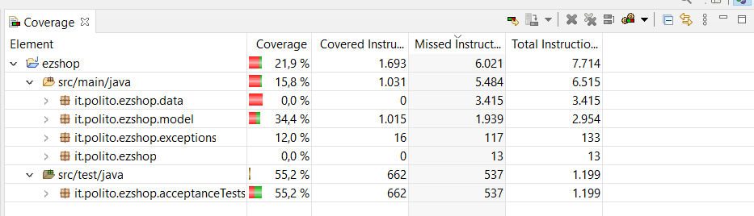

# Unit Testing Documentation

Authors: Andrea Colli Vignarelli, Roberto Comella, Stefano Palmieri, Filippo Peron

Date:18/05/2021

Version:0.1

# Contents

- [Black Box Unit Tests](#black-box-unit-tests)

- [White Box Unit Tests](#white-box-unit-tests)

# Black Box Unit Tests

 ### **Class *ProductType* - method *Constructor***

**Criteria for method Constructor:**
	
- Sign of quantity
- Length of the String location
- Length of the String note
- Length of the String productDescription
- Length of the String barCode
- sign of pricePerUnit
- sign of id

**Predicates for method Constructor:**

| Criterion                | Predicate |
| ------------------------ | --------- |
| Sign of quantity  | (minint, 1)     |
|                          |(0, maxint)     |
|  Length of the String productDescription	| > 0      |
|                          | = 0 ("")       |
|  Length of the String barCode	| > 0      |
|                          | = 0 ("")       |
| Sign of pricePerUnit  | (mindouble, 0)     |
|                          |(0, maxdouble)     |
| Sign of id  | (minint, 1)     |
|                          |(0, maxint)     |

**Boundaries for method Constructor**:

| Criterion | Boundary values |
| --------- | --------------- |
|   Sign of id        |  0,1               |
|   Sign of quantity        |  0,1               |
|   Sign of pricePerUnit        |  -0.0001,0,0.0001               |

 **Combination of predicates for method Constructor**

| Sign of quantity |  Length of String Location| Length of String note| Length of the String productDescription| Length of the String barCode | sign of pricePerUnit | sign of id | Valid/Invalid | Description of the test case: example of input and output    | JUnit test case |
| ----------------------- | ------------------------------------------------------------ |----------------------- | ------------------------------------------------------------ | --------------- | ----------------------- |----------------------- |----------------------- |----------------------- |----------------------- |
|   *		    | *     |    * 		|    *		| * |*            |				(minint, 0)  	| Invalid       | 	T0(-1, 1, "loc", "not","productDescription", " barCode", 1.2)->error |                 |
| (minint, 1)   | *     | 	*       | 	*       |*	|*            |		*|	 Invalid       				| 	T1(1,-1, "loc", "not","productDescription", " barCode", 1.2)->error |                 |
|   *		    | *     |    *      |   ''		|*	|*            |				*|	 Invalid         			| 	T4(1, 1, "loc", "not","", " barCode", 1.2)->error|                 |
|   *			| *     |    *  	|    *  	|''	|*            |				*|	 Invalid        			| 	T5(1, 1, "loc", "not","productDescription", "", 1.2)->error |                 |
|   *			| *     |    * 		|    *		| * |(mindouble, 0)  |	*|	 Invalid         			| 	T6(1, 1, "loc", "not","productDescription", "barCode", -0.1)->error|                 |
| (0, maxint)   | *    | *        | >0        |>0 |(0, maxdouble)  |(0, maxint)        | Valid       | T7(1, 1, "loc", "not","productDescription", "barCode", 1.1)->succesfully created                                              |                 |**Criteria for method *name*:**
	

 ### **Class *Product* - method *Constructor***
 
**Criteria for method Constructor:**
	

- Validate prodType

**Predicates for method Constructor:**

| Criterion                | Predicate |
| ------------------------ | --------- |
|  Validate prodType			| Valid     |
|                          |Null       |

**Boundaries for method Constructor**:

| Criterion | Boundary values |
| --------- | --------------- |
|    |     |

 **Combination of predicates for method Constructor**

| Validate prodType| Valid/Invalid | Description of the test case: example of input and output    | JUnit test case |
| --------------------| ----------------| ------------- | ------------------------------------------ |
| NULL     |	 Invalid       				| 	T0(Null->error |                 |
| Valid | Valid       | T1(ProductType)->succesfully created                                              |                 |

 ### **Class *SaleTransaction* - method *Constructor***

**Criteria for method Constructor:**
	
- Sign of ticketNumber
- Validate entries
- sign of discountRate
- sign of price

**Predicates for method Constructor:**

| Criterion                | Predicate |
| ------------------------ | --------- |
|	Sign of ticketNumber | (minint, 0)     |
|                          |(0, maxint)     |
|  Validate entries			| Valid     |
|                          |Null       |
| sign of discountRate  | (mindouble, 0)     |
|                          |(0, maxdouble)     |
| sign of price | (mindouble, 0)     |
|                          |(0, maxdouble)     |

**Boundaries for method Constructor**:

| Criterion | Boundary values |
| --------- | --------------- |
|   Sign of ticketNumber        |  0,1               |
|   Sign of discountRate        | -0.0001,0,0.0001               |
|   Sign of price        |  -0.0001,0,0.0001                |

 **Combination of predicates for method Constructor**

| Sign of ticketNumber| Validate entries| sign of discountRate| sign of price | Valid/Invalid | Description of the test case: example of input and output    | JUnit test case |
| --------------------| ----------------| ------------- | ------------------------------------------ | --------------- | ----------------------- |----------------------- |
| (minint, 1)   | *     | 	*       | 	*       |	 Invalid       				| 	T0(1,  LocalDate.now(), "debit", -1, t, 1.1, 1.1, Status)->error |                 |
| *			   | NULL     | 	*       | 	*       |	 Invalid       				| 	T1(1,  LocalDate.now(), "debit",1, null, 1.1, 1.1,Status)->error |                 |
| *   			| *     | 	(mindouble, 0)   | 	*       |	 Invalid       				| 	T2(1,  LocalDate.now(), "debit",1, t, -1.1, 1.1,Status)->error |                 |
| *			   | *     | 	*       | (mindouble, 0)      |	 Invalid       				| 	T3(1,  LocalDate.now(), "debit",1, t, 1.1, -1.1,Status)->error |                 |
| (0, maxint)   | Valid |(0, maxdouble)  |(0, maxdouble)        | Valid       | T4(1,  LocalDate.now(), "debit",1, t, 1.1, 1.1,Status )->succesfully created                                              |                 |

 ### **Class *TicketEntry* - method *Constructor***

**Criteria for method Constructor:**
	

- Length of the String barCode
- Length of the String productDescription
- sign of amount
- sign of pricePerUnit
- Sign of discountRate

**Predicates for method Constructor:**

| Criterion                | Predicate |
| ------------------------ | --------- |
|  Length of the String barCode	| > 0      |
|                          | = 0 ("")       |
|  Length of the String productDescription	| > 0      |
|                          | = 0 ("")       |
| Sign of amount  | (minint, 0)     |
|                          |(0, maxint)     |
| Sign of pricePerUnit  | (mindouble, 0)     |
|                          |(0, maxdouble)     |
| Sign of discountRate  | (mindouble, 0)     |
|                          |(0, maxdouble)     |

**Boundaries for method Constructor**:

| Criterion | Boundary values |
| --------- | --------------- |
|   Sign of amount        |  0,1               |
|   Sign of pricePerUnit        |  -0.0001,0,0.0001               |
|   Sign of discountRate        |   -0.0001,0,0.0001             |

 **Combination of predicates for method Constructor**

| Length of the String barCode |  Length of the String productDescription|   Sign of amount        | sign of pricePerUnit | sign of discountRate | Valid/Invalid | Description of the test case: example of input and output    | JUnit test case |
| ----------------------- | ------------------------ | ------------- | ------------------------------------------------------------ | --------------- | ----------------------- |----------------------- |----------------------- |
|   ''      |   *  		|*	|*            |				*|	 Invalid         			|	T0("","productDescription",1, -1.1, 1.1)->error |                 |
|	*		|   ''		|*	|*            |				*|	 Invalid         			| 	T1("barCode","",1, -1.1, 1.1)->error|                 |
|    *  	|    *  	|(minint, 0)|*            |				*|	 Invalid        			| 	T2("barCode","productDescription",-1, 1.1, 1.1)->error |                 |
|    * 		|    *		| * |(mindouble, 0)  |	*|	 Invalid         			| 	T3("barCode","productDescription",1, -1.1, 1.1)->error|                 |
|    * 		|    *		| * |*            |				(mindouble, 0)  	| Invalid       | 	T4("barCode","productDescription",1, 1.1, -1.1)->error |                 |
| >0        | >0        |(0, maxint)|(0, maxdouble)  |(0, maxdouble)        | Valid       | T6("barCode","productDescription",1, 1.1, 1.1)->succesfully created                                              |                 |

 ### **Class *AccountBook* - method *Constructor***

**Criteria for method Constructor:**
	
- Sign of balance
- Validate currTransactions

**Predicates for method Constructor:**

| Criterion                | Predicate |
| ------------------------ | --------- |
| Sign of balance  | (mindouble, 0)     |
|                          |(0, maxdouble)     |
|  Validate currTransactions	| Valid     |
|                          |Null       |

**Boundaries for method Constructor**:

| Criterion | Boundary values |
| --------- | --------------- |
|  Sign of balance       |  -0.0001,0,0.0001               |

 **Combination of predicates for method Constructor**

| Sign of balance |  Validate currTransactions| Valid/Invalid | Description of the test case: example of input and output    | JUnit test case |
| ----------------------- | ------------------------ | ------------- | ------------------------------------------------------------ | --------------- |
| (mindouble, 1)   | 	* |	 Invalid       				| 	T0(-1, ArrayList<BalanceOperation>())->error |                 |
|   *			| Null    |  Invalid         			| 	T1(1, null)->error|                 |
| (0, maxdouble)   | Valid   |  Valid       | T2(1, ArrayList<BalanceOperation>())->succesfully created                                              |                 |

 ### **Class *BalanceOperation* - method *Constructor***

**Criteria for method Constructor:**
	
- Sign of id
- Validate date
- sign of money
- Length of the String type

**Predicates for method Constructor:**

| Criterion                | Predicate |
| ------------------------ | --------- |
|	Sign of id | (minint, 1)     |
|                          |(0, maxint)     |
|  Validate date	| Valid     |
|                          |Null       |
| sign of money  | (mindouble, 0)     |
|                          |(0, maxdouble)     |
| Length of the String type | '' |
|                          | >0  |

**Boundaries for method Constructor**:

| Criterion | Boundary values |
| --------- | --------------- |
|   Sign of id        |  0,1               |
|   sign of money        |  -0.0001,0,0.0001               |

 **Combination of predicates for method Constructor**

| Sign of id | Validate date | sign of money| Length of the String type | Valid/Invalid | Description of the test case: example of input and output    | JUnit test case |
| --------------------| ----------------| ------------- | ------------------------------------------------------------ | --------------- | ----------------------- |----------------------- |
| (minint, 1)   | *     | 	*       | 	*       |	 Invalid       				| 	T0(-1, data, 0.1,"return")->error |                 |
| *			   | NULL     | 	*       | 	*       |	 Invalid       				| 	T1(1, null, 0.1,"return")->error |                 |
| *   			| *     | 	(mindouble, 0)   | 	*       |	 Invalid       				| 	T2(1, data, -0.1,"return")->error |                 |
| *			   | *     | 	*       	| ''     |	 Invalid       				| 	T3(1, data, 1.01,"")->error |                 |
| (0, maxint)   | Valid |(0, maxdouble)  | >0        | Valid       | T4(1, data, 1.01,"return")->succesfully created                                              |                 |

### **Class *Customer* - method *Constructor***

**Criteria for method Constructor:**
	
- Sign of id
- Length of the String name
- Length of the String card

**Predicates for method Constructor:**

| Criterion                | Predicate |
| ------------------------ | --------- |
|	Sign of id | (minint, 1)     |
|                          |(0, maxint)     |
| Length of the String name | '' |
|                          | >0  |
| Length of the String card | '' |
|                          | >0  |

**Boundaries for method Constructor**:

| Criterion | Boundary values |
| --------- | --------------- |
|   Sign of id        |  0,1               |

 **Combination of predicates for method Constructor**

| Sign of id | Length of the String name |  Length of the String card | Valid/Invalid | Description of the test case: example of input and output    | JUnit test case |
| --------------------| ----------------| ------------- | ------------------------------------------------------------ | --------------- | ----------------------- |
| (minint, 1)   | *     | 	*       | Invalid       				| 	T0(-1,  "name", "card")->error |                 |
| *			   | ''  | 	*       	|	 Invalid       				| 	T1(1,  "", "card")->error |                 |
| *			   | * | 	''       	|	 Invalid       				| 	T2(1,  "name", "")->error |                 |
| (0, maxint)   | >0 | >0        | Valid       | T3(1,  "name", "card")->succesfully created                                              |                 |

### **Class *LoyaltyCard* - method *Constructor1***

**Criteria for method Constructor:**
	

- Length of the String id
- Sign of point

**Predicates for method Constructor:**

| Criterion                | Predicate |
| ------------------------ | --------- |
| Length of the String id | '' |
|                          | >0  |
|	Sign of point | (minint, 1)     |
|                          |(0, maxint)     |

**Boundaries for method Constructor**:

| Criterion | Boundary values |
| --------- | --------------- |
|   Sign of point       |  0,1               |

 **Combination of predicates for method Constructor**

|Length of the String id |Sign of point | Valid/Invalid | Description of the test case: example of input and output    | JUnit test case |
| --------------------| ----------------| ------------- | ------------------------------------------------------------ | --------------- | 
| ''   | *  |	 Invalid       				| 	T0("",  1)->error |                 |
|  *  | (minint, 1)  | Invalid       				| 	T1("id",  -1)->error |                 |
| >0  | (0, maxint)  | Valid       | T2("34529",  1)->succesfully created                                              |                 |

### **Class *LoyaltyCard* - method *Constructor2***

**Criteria for method Constructor:**
	

- Length of the String id

**Predicates for method Constructor:**

| Criterion                | Predicate |
| ------------------------ | --------- |
| Length of the String id | '' |
|                          | >0  |

**Boundaries for method Constructor**:

| Criterion | Boundary values |
| --------- | --------------- |
|       |              |

 **Combination of predicates for method Constructor**

| Length of the String id| Valid/Invalid | Description of the test case: example of input and output    | JUnit test case |
| --------------------| ----------------| ------------- | ------------------------------------------------------------ | 
| ''   | 	 Invalid       				| 	T3("")->error |                 |
| >0  |  Valid       | T4("34529")->succesfully created                                              |                 |

### **Class *LoyaltyCard* - method *isValidCard***

**Criteria for method Constructor:**
	

- Length of the String id

**Predicates for method Constructor:**

| Criterion                | Predicate |
| ------------------------ | --------- |
| Length of the String id | '' |
|                          | >0  |

**Boundaries for method Constructor**:

| Criterion | Boundary values |
| --------- | --------------- |
|       |              |

 **Combination of predicates for method Constructor**

| Length of the String id | Valid/Invalid | Description of the test case: example of input and output    | JUnit test case |
| --------------------| ----------------| ------------- | ------------------------------------------------------------ | 
| ''   | 	 Invalid       				| 	T5("")->false |                 |
| >0  |  Valid       | T6("34529")->true                                              |                 |

### **Class *User* - method *Constructor***

**Criteria for method Constructor:**
	
- Sign of id
- Length of the String username
- Length of the String password
- valid role

**Predicates for method Constructor:**

| Criterion                | Predicate |
| ------------------------ | --------- |
|	Sign of id | (minint, 1)     |
|                          |(0, maxint)     |
| Length of the String username | '' |
|                          | >0  |
| Length of the String password | '' |
|                          | >0  |
| valid role | null |
|                          | valid |

**Boundaries for method Constructor**:

| Criterion | Boundary values |
| --------- | --------------- |
|   Sign of id        |  0,1               |

 **Combination of predicates for method Constructor**

| Sign of id | Length of the String username |  Length of the String password | valid role| Valid/Invalid | Description of the test case: example of input and output    | JUnit test case |
| --------------------| ----------------| ------------- | ------------------------------------------------------------ | --------------- | ----------------------- |----------------------- |
| (minint, 1)   | *     | 	*    |*   | Invalid       				| 	T0(-1,  "username", "password","Cashier")->error |                 |
| *			   | ''  | 	*       |*	|	 Invalid       				| 	T1(1,  "", "password","Cashier")->error |                 |
| *			   | * | 	''       |*	|	 Invalid       				| 	T2(1,  "username", "","Cashier")->error |                 |
| *			   | * | 	*       |null	|	 Invalid       				| 	T3(1,  "username", "password",null)->error |                 |
| (0, maxint)   | >0 | >0    |Valid    | Valid       | T4(1,  "username", "password","Cashier")->succesfully created                                              |                 |

### **Class *Order* - method *Constructor***

**Criteria for method Constructor:**
	
- Sign of id
- Sign of balanceId
- Length of the String productCode
- Sign of pricePerUnit
- Sign of quantity
- valid status

**Predicates for method Constructor:**

| Criterion                | Predicate |
| ------------------------ | --------- |
|	Sign of id | (minint, 1)     |
|                          |(0, maxint)     |
|	Sign of balanceId | (minint, 1)     |
|                          |(0, maxint)     |
| Length of the String productCode | '' |
|                          | >0  |
|	Sign of pricePerUnit | (mindouble, 0)    |
|                          |(0, maxdouble)      |
|	Sign of quantity | (minint, 1)     |
|                          |(0, maxint)     |
| valid status| null |
|                          | valid |

**Boundaries for method Constructor**:

| Criterion | Boundary values |
| --------- | --------------- |
|   Sign of id        |  0,1               |
|   Sign of balanceId        |  0,1               |
|   Sign of pricePerUnit        |  -0.0001,0,0.0001              |
|   Sign of quantity        |  0,1               |

 **Combination of predicates for method Constructor**

| Sign of id | Sign of balanceId | Length of the String productCode |  Sign of pricePerUnit| Sign of quantity | valid status | Valid/Invalid | Description of the test case: example of input and output    | JUnit test case |
| --------------------| ----------------| ------------- | ------------------------------------------------------------ | --------------- | ----------------------- |----------------------- |----------------------- |----------------------- |
| (minint, 1)   | *     | 	*    |* |*  |*    | Invalid       				| 	T0(-1, 1, "productCode", 1.1, 1, "PAYED")->error |                 |
| *			   | (minint, 1)  | 	*       |*|*  |* 	|	 Invalid       				| 	T1(1, -1, "productCode", 1.1, 1, "PAYED")->error |                 |
| *			   | * 	| 	''       |*	|*  |* |	 Invalid       				| 	T2(1, 1, "", 1.1, 1, "PAYED")->error |                 |
| *			   | * | 	*    |(mindouble, 0) |*    |*|	 Invalid       				| 	T3(1, 1, "productCode", -1.1, 1, "PAYED")->error |                 |
| *			   | * | 	*    |*  |(minint, 1)    |*|	 Invalid       				| 	T4(1, 1, "productCode", 1.1, -1, "PAYED")->error |                 |
| *			   | * | 	*    |*  |*    |null|	 Invalid       				| 	T5(1, 1, "productCode", 1.1, 1, "")->error |                 |
| (0, maxint)   |(0, maxint) | >0    |(0, maxdouble)  |(0, maxint) |valid    | Valid       | T6(1, 1, "productCode", 1.1, 1, "PAYED")->succesfully created                                              |                 |

### **Class *CreditCard* - method *Constructor***

**Criteria for method Constructor:**

- Length of the String crediCard
- Sign of amount

**Predicates for method Constructor:**

| Criterion                | Predicate |
| ------------------------ | --------- |
| Length of the String crediCard | '' |
|                          | >0  |
|	Sign of amount | (mindouble, 0)    |
|                          |(0, maxdouble)      |

**Boundaries for method Constructor**:

| Criterion | Boundary values |
| --------- | --------------- |
|   Sign of amount        |  -0.0001,0,0.0001              |

 **Combination of predicates for method Constructor**

| Length of the String crediCard | Sign of amount  | Valid/Invalid | Description of the test case: example of input and output    | JUnit test case |
| --------------------| ----------------| ------------- | ------------------------------------------------------------ | --------------- | 
| 	''       |*	|	 Invalid       				| 	T0("",  1.2)->error |                 |
| 	*    |(mindouble, 0) |	 Invalid       		| 	T1("creditCard",  -1.2)->error |                 |
| >0    |(0, maxdouble) | Valid     			| T2("creditCard",  1.2)->succesfully created                                              |                 |

### **Class *ReturnTransaction* - method *Constructor1***

**Criteria for method Constructor:**
	
- Sign of balanceID
- sign of saleNumber
- Validate date

**Predicates for method Constructor:**

| Criterion                | Predicate |
| ------------------------ | --------- |
|	Sign of balanceID | (minint, 0)     |
|                          |(0, maxint)     |
|	Sign of saleNumber | (minint, 0)     |
|                          |(0, maxint)     |
|  Validate date			| Valid     |
|                          |Null       |

**Boundaries for method Constructor**:

| Criterion | Boundary values |
| --------- | --------------- |
|   Sign of balanceID        |  0,1               |
|   Sign of saleNumber        |  0,1               |

 **Combination of predicates for method Constructor**

| Sign of balanceID | Sign of saleNumber | Validate date|  Valid/Invalid | Description of the test case: example of input and output    | JUnit test case |
| --------------------| ----------------| ------------- | ------------------------------------------ | --------------- | ----------------------- |
| (minint, 1)   | *     | 	*       |	 Invalid       				| 	T0(-1,1, data)->error |                 |
| *			   |  (minint, 1)    | 	*       |	 Invalid       				| 	T1(1,-1, data)->error |                 |
| *   			| *     | 	NULL 	| Invalid       				| 	T2(1,-1, null)->error |                 |
| (0, maxint)   | (minint, 1) |Valid        | Valid       | T3(1,1, data)->succesfully created                                              |                 |

### **Class *ReturnTransaction* - method *Constructor2***

**Criteria for method Constructor:**	

- Sign of id
- Validate date
- sign of money
- Length of the String type
- Sign of saleNumber
- valid Status

**Predicates for method Constructor:**

| Criterion                | Predicate |
| ------------------------ | --------- |
|	Sign of id | (minint, 1)     |
|                          |(0, maxint)     |
|  Validate date	| Valid     |
|                          |Null       |
| sign of money  | (mindouble, 0)     |
|                          |(0, maxdouble)     |
| Length of the String type | '' |
|                          | >0  |
|	Sign of saleNumber | (minint, 1)     |
|                          |(0, maxint)     |
| valid Status | null |
|                          | valid |

**Boundaries for method Constructor**:

| Criterion | Boundary values |
| --------- | --------------- |
|   Sign of id        |  0,1               |
|   sign of money        |  -0.0001,0,0.0001               |
|   Sign of saleNumber        |  0,1               |

 **Combination of predicates for method Constructor**

| Sign of id | Validate date | sign of money| Length of the String type |Sign of saleNumber| validStatus  | Valid/Invalid | Description of the test case: example of input and output    | JUnit test case |
| --------------------| ----------------| ------------- | ------------------------------------------------------------ | ---------------  | ---------------  | --------------- | ----------------------- |----------------------- |
| (minint, 1)   | *     | 	*       | 	*       |*|*|	 Invalid       				| 	T4(-1,1, data, 0.1, "return", Status)->error |                 |
| *			   | NULL     | 	*       | 	*      |*|* |	 Invalid       				| 	T5(1,-1, data, 0.1, "return", Status)->error |                 |
| *   			| *     | 	(mindouble, 0)   | 	*    |*|*   |	 Invalid       				| 	T6(1,1, null, 0.1, "return", Status)->error |                 |
| *			   | *     | 	*       	| ''    |*|* |	 Invalid       				| 	T7(1,1, data, -0.1, "return", Status)->error |                 |
|  *  | *     | 	*       | 	*      |(minint, 1)|* |	 Invalid       				| 	T8(1,1, data, 0.1, "", Status)->error |                 |
| *   | *     | 	*       | 	*     |*|null|	 Invalid       				| 	T9(-1,1, data, 0.1, "return", null)->error |                 |
| (0, maxint)   | Valid |(0, maxdouble)  | >0   |(0, maxint) | valid    | Valid       | T10(1,1, data, 1.1, "return", Status)->succesfully created                                              |                 |

### **Class *ProductType* - method *checkBarcode***

**Criteria for method Constructor:**	

- Length of the String Barcode

**Predicates for method Constructor:**

| Criterion                | Predicate |
| ------------------------ | --------- |
| Length of the String Barcode | x<12 |
|							|x>14	|
|                          | x==13  |

**Boundaries for method Constructor**:

| Criterion | Boundary values |
| --------- | --------------- |

 **Combination of predicates for method Constructor**

|Length of the String type   | Valid/Invalid | Description of the test case: example of input and output    | JUnit test case |
| ------------------------------------------------------------ | ---------------  | ---------------  | --------------- |
| x<14  |	 Invalid       				| 	T9("07056324447")->false |                 |
|  x==13     | Valid       | T8("0705632441947")->true                                              |                 |
|  x>14  |	 Invalid       				| 	T10("0744444056324447")->false |                 |

# White Box Unit Tests

### Test cases definition

| Unit name | JUnit test case |
|-----------|-----------------|
|SaleTransaction.getTotalAmount|T5|
|AccountBook.listTransactionsInRange|T3|

### Code coverage report

### Loop coverage analysis

|Unit name | Loop rows | Number of iterations | JUnit test case |
|----------|-----------|----------------------|---|
|SaleTransaction.getTotalAmount | 0-3|	1	|	T5		|
|AccountBook.listTransactionsInRange|1|1|T3|

